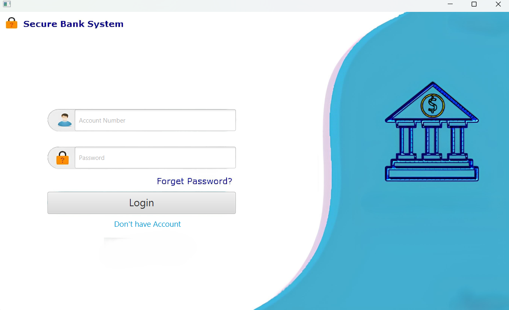
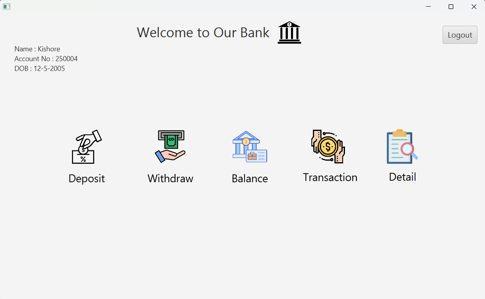
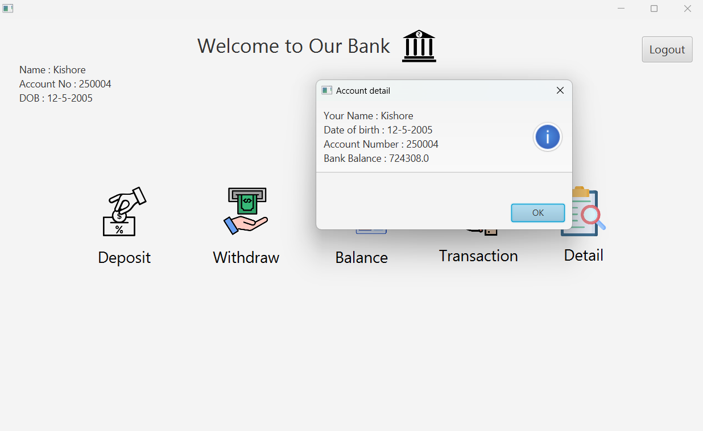
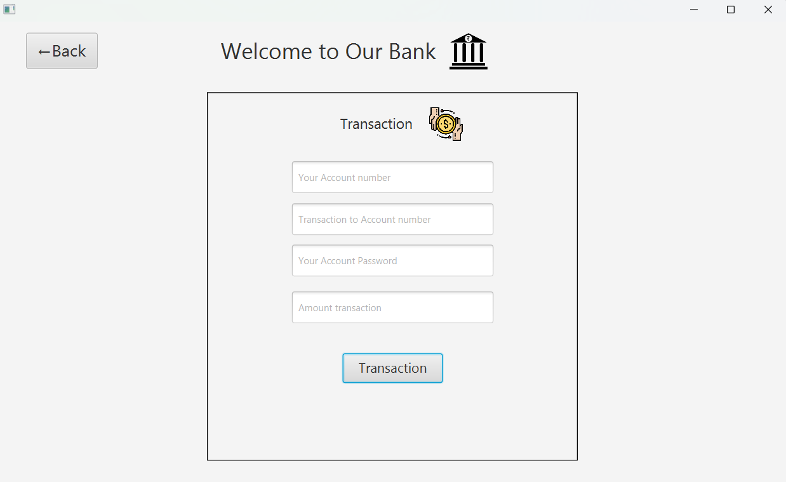
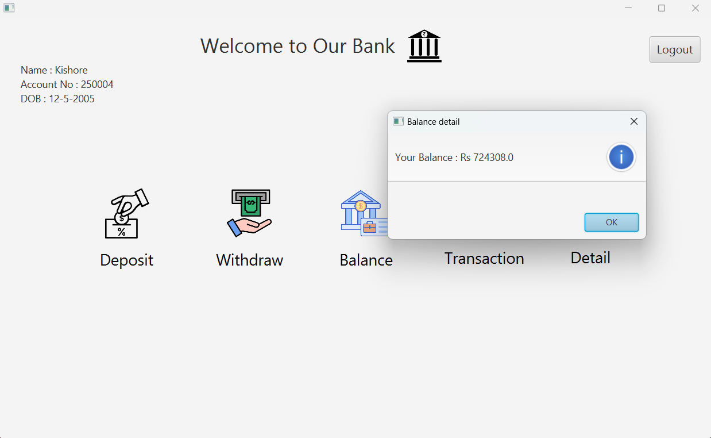
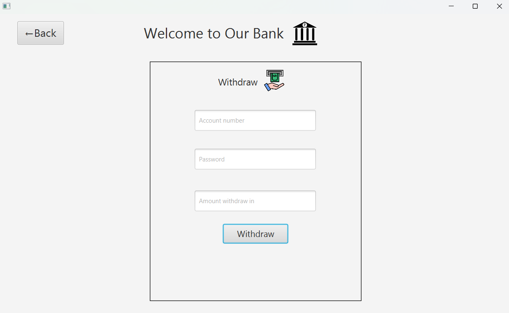
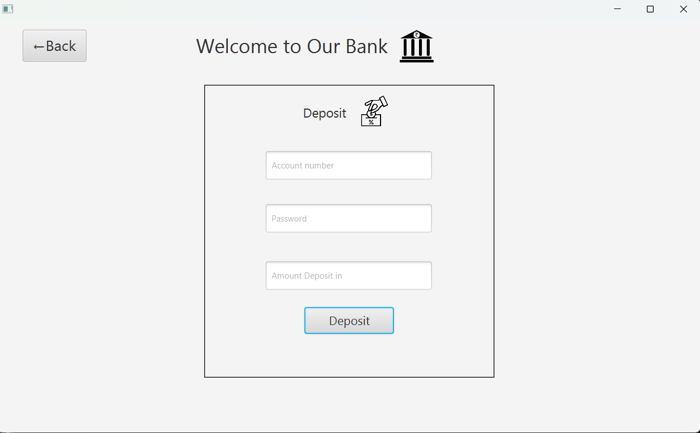

# How to Run the App

### NOTE :  Make sure JDK is installed and jar is on PATH 
### Example :
            C:\Program Files\Java\javafx-sdk-23.0.2\bin

## To Build and Run (First Time or Rebuild)
Double click on `build_and_run.bat`

## To Only Run (After Build)
Double click on `run.bat`

# Project Screens Overview

This document provides an overview of the UI screens included in this project. Each PNG file represents a specific page or functionality of the application.

## 1. Login Page

Description: This is the login interface where users enter their credentials to access the application.

---

## 2. Dashboard

Description: The main dashboard that provides an overview of user activities and navigation options.

---

## 3. Detail Page

Description: Displays detailed information related to a s user account.

---

## 4. Transaction Page

Description: Interface for users to Transact money from one account to another.

---

## 5. Balance Page

Description: Displays the current balance available in the user's account.

---

## 6. Withdraw Page

Description: Interface for users to withdraw money from their account.

---

## 7. Deposit Page

Description: Interface for users to deposit money into their account.

